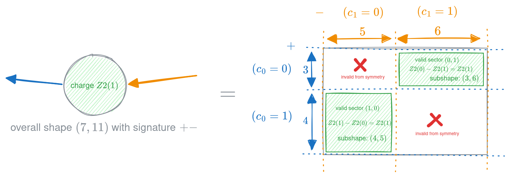
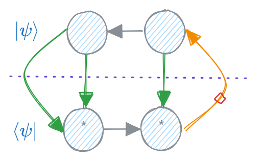

# symmray

A minimal library for block sparse, abelian symetric and fermionic arrays,
designed to look as much as possible like standard ndarrays, whose blocks can
be backed by `numpy`, `torch` or any other `autoray` compatible library.


## Installation

**Installing the latest version directly from github:**

If you want to checkout the latest version of features and fixes, you can
install directly from the github repository:
```bash
pip install -U git+https://github.com/jcmgray/symmray.git
```

**Installing a local, editable development version:**

If you want to make changes to the source code and test them out, you can
install a local editable version of the package:
```bash
git clone https://github.com/jcmgray/symmray.git
pip install --no-deps -U -e symmray/
```


## Usage

`symmray` objects are designed so that, as much as possible, one can interact
with them in the same way as standard arrays. You can use the functions from
the ``symmray`` namespace directly:

```python
import symmray as sr

# create some random arrays:
a, b, c, d, e, f = [sr.utils.rand_index("Z2", d) for d in [2, 3, 4, 5, 6, 7]]
x = sr.utils.get_rand("Z2", shape=[a, b, c.conj(), d], fermionic=True)
y = sr.utils.get_rand("Z2", shape=[e, a.conj(), f, c], fermionic=True)
x, y
# (Z2FermionicArray(shape~(2, 3, 4, 5):[++-+], charge=0, num_blocks=8),
#  Z2FermionicArray(shape~(6, 2, 7, 4):[+--+], charge=0, num_blocks=8))

# contract them:
z = sr.tensordot(x, y, axes=[(0, 2), (1, 3)])
z
# Z2FermionicArray(shape~(3, 5, 6, 7):[+++-], charge=0, num_blocks=8)

print(z)
# Z2FermionicArray(ndim=4, charge=0, indices=[
#     (3 = 2+1 : +[0,1])
#     (5 = 3+2 : +[0,1])
#     (6 = 2+4 : +[0,1])
#     (7 = 6+1 : -[0,1])
# ], num_blocks=8, backend=numpy, dtype=float64)

# fuse and decompose:
sr.linalg.svd(z.fuse((0, 3), (1, 2)))
# (Z2FermionicArray(shape~(21, 21):[++], charge=0, num_blocks=2),
#  BlockVector(total_size=21, num_blocks=2),
#  Z2FermionicArray(shape~(21, 30):[-+], charge=0, num_blocks=2))
```

or you can use the automatic dispatch library `autoray` to support multiple
backends including `symmray`:

```python
import autoray as ar

z = ar.do("tensordot", x, y, axes=[(0, 2), (1, 3)])
```

or you can use the [python array api](https://data-apis.org/array-api/latest/):

```python
xp = x.__array_namespace__()
z = xp.tensordot(x, y, axes=[(0, 2), (1, 3)])
```


`symmray` also uses `autoray` **internally** to handle manipulating blocks *within*
an array, meaning that these can be `numpy`, `torch`, `jax` or any other
`autoray` compatible library.

Whilst block sparse arrays do not have such a well defined notion of shape as
dense arrays, for ease and compatibility with other libraries, `symmray` arrays
do have a `.shape` attribute which is the shape of the dense array that would
be returned by calling `to_dense` on the array, and a similarly defined
`.size`. Likewise, `symmray` supports fusing and unfusing of indices via
`reshape` (as long as it is clear what is meant by the new shape).

### Quick-start tensor networks and Hamiltonians

`symmray` provides constructors for various `quimb.tensor.TensorNetwork` networks:

- `TN_abelian_from_edges_rand`
- `TN_fermionic_from_edges_rand`
- `PEPS_abelian_rand` (2D specific)
- `PEPS_fermionic_rand` (2D specific)

Along with constructors for common hamiltonians:

- `ham_tfim_from_edges`
- `ham_heisenberg_from_edges`
- `ham_fermi_hubbard_from_edges`
- `ham_fermi_hubbard_spinless_from_edges` (AKA 't-V' model)

These constructors automatically chooose various defaults. See the `examples`
folder for usage.


### Block sparse abelian symmetric arrays

The core `AbelianArray` object consists of 4 main components:

1. `.indices`: a sequence of `BlockIndex` instances describing the charge
   distribution and 'dualness' of each dimension.
2. `.charge`: an overall charge for the array, which sets which combinations
   of index charges ('sectors') are allowed.
3. `.blocks`: a dict mapping each non-zero sector to a 'raw' array.
4. `.symmetry`: an object defining allowed charges and how they combine.

Specific subclasses of `AbelianArray` have a static `.symmetry` class
attribute.

The `BlockIndex` object consists of 2 main components:

1. `.chargemap`: a dict mapping each charge to its size. The total size of the
   index is the sum of the sizes of all charges.
2. `.dual`: a boolean indicating whether the index is 'dual' or not. By
   convention:

    - `dual=False` means index flows 'outwards' / (+ve) / ket-like
    - `dual=True` means index flows 'inwards' / (-ve) / bra-like

One convenient way to create `AbelianArray` instances is via the `from_fill_fn`
method, which takes a function with signature `fn(shape) -> array_like` and
uses it to fill each valid sector of the array.

```python
import symmray as sr
import numpy as np

indices = (
    sr.BlockIndex(chargemap={0: 3, 1: 4}, dual=False),
    sr.BlockIndex(chargemap={0: 5, 1: 6}, dual=True),
)

x = sr.Z2Array.from_fill_fn(
    fill_fn=np.ones,
    indices=indices,
    charge=1,
)
x
# Z2Array(shape~(7, 11):[+-], charge=1, num_blocks=2)

x.blocks
# {(0,
#   1): array([[1., 1., 1., 1., 1., 1.],
#         [1., 1., 1., 1., 1., 1.],
#         [1., 1., 1., 1., 1., 1.]]),
#  (1,
#   0): array([[1., 1., 1., 1., 1.],
#         [1., 1., 1., 1., 1.],
#         [1., 1., 1., 1., 1.],
#         [1., 1., 1., 1., 1.]])}
```

We can pictorially represent this like so:



You can also create `AbelianArray` instances using the methods:

- `AbelianArray(indices, charge, blocks)`
- `AbelianArray.from_blocks(blocks, duals, charges)` which calculates the
  index chargemaps from the sectors and blocks themselves.
- `AbelianArray.random(indices, charge)` which uses a random `fill_fn`
- `AbelianArray.from_dense(array, index_maps, duals, charge)` which converts
  a dense array to a block sparse array given a mapping for each axis, which
  specifies the charge of each linear index in the dense array.

Key functions which match the numpy versions are:

- `conj`
- `reshape`
- `tensordot`
- `trace`
- `transpose`

With additional `symmray` specific key functions:

- `fuse`
- `multiply_diagonal`

Fuse in particular is a crucial function for A. performing efficient
contractions, B. performing linear algebra decompositions, as well as various
other tensor network manipulations. You can either fuse and unfuse directly, or
by using `reshape`. Note that if a `symmray` array is quite sparse (e.g. with
U1 symmetry), then the resulting fused/reshaped shape will not necessarily
match the dense specification.

The key function `tensordot` can use one of two methods.

- `tensordot(x, y, axes, mode="fused")`: fuse the two arrays into block
  diagonal matrices and then unfuse the result. This can be much faster, though
  possibly requires explicitly filling missing blocks with zeros.
- `tensordot(x, y, axes, mode="blockwise")`: compute the contraction by
  directly looping over the blocks of `x` and `y` and contracting them. This
  has quite high overhead for large numbers of blocks.


### Fermionic arrays

The approach to fermionic arrays `symmray` takes is equivalent to the
'Grassmann' or graded algebra approach. This associates a fermionic parity to
each charge, combined with the directionality specified by `dual`, allows
all fermionic swaps and the relevant sector phase changes to be handled
essentially locally.

The core `FermionicArray` is a subclass of `AbelianArray` and instantiated in
the same way:

```python
indices = (
    sr.BlockIndex(chargemap={-1: 2, 0: 2, 1: 3}, dual=False),
    sr.BlockIndex(chargemap={0: 2, 2: 3, 3: 4}, dual=True),
)

x = sr.U1FermionicArray.random(
    indices=indices,
    charge=-2,
)
print(x)
# U1FermionicArray(ndim=2, charge=-2, indices=[
#     (7 = 2+2+3 : +[-1,0,1])
#     (9 = 2+3+4 : -[0,2,3])
# ], num_blocks=2, backend=numpy, dtype=float64)
```

Phases are lazily tracked into the attribute `.phases` when:

- transposing
- fusing
- conjugating
- contracting via tensordot or `__matmul__` / `@`
- tracing
- linear algebra decompositions

via the methods:

- `FermionicArray.phase_flip`: virtually insert 'parity' tensors on some axes
- `FermionicArray.phase_transpose`: compute the phase of a 'virtual' transpose

And inserted when needed using:

- `FermionicArray.phase_sync`: actually multiply the blocks by the phases.


#### Multiple odd-parity fermionic arrays - `oddpos`

If you want to work with networks involving multiple odd-parity tensors then
you must supply any *sortable* label `oddpos` to the `FermionicArray`
constructor, which acts like a sequence of dummy indices with odd-parity.
Whenever two arrays with `oddpos` are contracted, a global phase
is possibly inserted coming from sorting these dummy odd-parity indices.

An initial single value of ``oddpos`` is converted into a length 1 tuple, and
these are then concatenated and sorted when two arrays are contracted. For
example, if `a` and `b` have accrued the following `oddpos` values:
```
oddpos_a = (2, 3, 5)
oddpos_b = (4, 6,)
```
their contraction would result in:
```
(2, 3, 5, 4, 6)
-> sort introduces phase ->
(2, 3, 4, 5, 6)
-> neighboring oddpos pairs can then be cancelled ->
oddpos_new = (6,)
```

This gives a canonical sign to the overall network that is handled
automatically and locally (once the initial `oddpos` values are chosen.)
The phase is tracked lazily via `FermionicArray.phase_global`.

If for some reason you would like to create a `FermionicArray` with multiple
labels then you should supply a **list** of labels.


#### Conjugation and tensor networks

Conjugating a fermionic array is handled by the `.conj()` method, with two
notable options, `phase_permutation=True` by default and `phase_dual=False` by
default. The former applies phases as if we had reversed the order of axes
(though we don't change the data layout). The latter applies 'virtual' parity
tensors to dual indices, which can be desired if they are the 'dangling' legs
of a tensor network.

By default, only the first happens. This implies if you have a tensor network
wavefunction $|\psi\rangle$ where all *dangling* indices are ket-like
(dual=False), then conjugating each tensor locally gives you the bra
wavefunction $\langle\psi|$ such that the contraction $\langle\psi|\psi\rangle$
yields the norm squared of the wavefunction.

If the tensor network has both bra-like and ket-like dangling indices
(e.g. in the infinite setting or using cluster approximations), then the
dangling dual legs of the conjugated network must be explicitly phase-flipped.

For example, in the following network:



the only index that needs to be phase-flipped beyond `phase_permutation` is the
orange dangling 'ket' index in the bra $\langle\psi|$, indicated by the red
diamond.


#### Local fermionic operators

Many tensor network algorithms involve applying local fermionic operators to
the wavefunction. Such local operators need to be expressed in a local basis
with a particular ordering and resulting phases. `symmray` provides several
common operators:

- `fermi_hubbard_local_array`:

$$
-t (a_\uparrow^\dagger b_\uparrow + b_\uparrow^\dagger a_\uparrow + a_\downarrow^\dagger b_\downarrow + b_\downarrow^\dagger a_\downarrow) + U(a_\uparrow^\dagger a_\uparrow a_\downarrow^\dagger a_\downarrow + b_\uparrow^\dagger b_\uparrow b_\downarrow^\dagger b_\downarrow) - \mu (a_\uparrow^\dagger a_\uparrow + a_\downarrow^\dagger a_\downarrow + b_\uparrow^\dagger b_\uparrow + b_\downarrow^\dagger b_\downarrow)
$$

- `fermi_hubbard_spinless_local_array`:

$$
-t(a^\dagger b + b^\dagger a) + V a^\dagger a b^\dagger b - \mu(a^\dagger a + b^\dagger b)
$$

- `fermi_number_operator_spinful_local_array`:

$$
a_\uparrow^\dagger a_\uparrow + a_\downarrow^\dagger a_\downarrow
$$

- `fermi_number_operator_spinless_local_array`:

$$
a^\dagger a
$$

- `fermi_spin_operator_local_array`:

$$
\frac{1}{2}(a_\uparrow^\dagger a_\uparrow - a_\downarrow^\dagger a_\downarrow)
$$

 plus lower level functions for building custom ones:

- `build_local_fermionic_array`
- `build_local_fermionic_elements`

These latter functions take a specification of `terms`, which is a sequence of tuples of the
form `(coeff, ops)` where `ops` is a sequence of symbolic `FermionicOperator`
objects, (or equivalent pair `(label, op)`).

Secondly they take a specification of `bases`. This is a sequence of each local
basis, each a sequence of `FermionicOperator` objects.

For example, imagine we want to build the term:

$$8 n_a n_b  - 2 (n_a + n_b)= 8 a^\dagger a b^\dagger b - 2 a^\dagger a - 2 b^\dagger b$$

into an array with elements defined:

$$o = \langle i' | \langle j' | \hat O | i \rangle | j \rangle$$

where the two bases are given by: $| i \rangle = \{|0\rangle, a^\dagger|0\rangle\}$ and $| j \rangle = \{|0\rangle, b^\dagger|0\rangle\}$. We can build this operator as follows:

```python
a, b = map(sr.FermionicOperator, 'ab')
# you can also use strings or pairs like
# adag = 'a+' or ('a', '+')
# a    = 'a-' or ('a', '-')

terms = [
    (+8, (a.dag, a, b.dag, b)),
    (-2, (a.dag, a)),
    (-2, (b.dag, b)),
]

bases = [
    [(), (a.dag,)],
    [(), (b.dag,)],
]

# get just the non-zero elements (with phases)
sr.build_local_fermionic_elements(
    terms, bases
)
# {(0, 1, 0, 1): -2.0, (1, 0, 1, 0): -2.0, (1, 1, 1, 1): -4.0}
```

To build an actual fermionic array we need to specify a symmetry and a `index_map` for each local basis that maps each index to a charge. For example, if we want to build the above operator into a `U1FermionicArray` we could do:

```python
sr.build_local_fermionic_array(
    terms,
    bases,
    symmetry="U1",
    index_maps=[
        (0, 1),  # charges for basis i
        (0, 1),  # charges for basis j
    ]
)
# U1FermionicArray(shape~(2, 2, 2, 2):[++--], charge=0, num_blocks=6)
```

Fermi-hubbard and spinless fermi-hubbard operators have built-in local functions:
```python
sr.fermi_hubbard_local_array("U1U1", t=1.0, U=8.0, mu=5).blocks
# {((0, 0), (0, 0), (0, 0), (0, 0)): array([[[[0.]]]]),
#  ((0, 0), (0, 1), (0, 0), (0, 1)): array([[[[-5.]]]]),
#  ((0, 0), (0, 1), (0, 1), (0, 0)): array([[[[-1.]]]]),
#  ((0, 0), (1, 0), (0, 0), (1, 0)): array([[[[-5.]]]]),
#  ((0, 0), (1, 0), (1, 0), (0, 0)): array([[[[-1.]]]]),
#  ((0, 0), (1, 1), (0, 0), (1, 1)): array([[[[-2.]]]]),
#  ((0, 0), (1, 1), (0, 1), (1, 0)): array([[[[1.]]]]),
#  ((0, 0), (1, 1), (1, 0), (0, 1)): array([[[[-1.]]]]),
#  ((0, 0), (1, 1), (1, 1), (0, 0)): array([[[[0.]]]]),
#  ((0, 1), (0, 0), (0, 0), (0, 1)): array([[[[-1.]]]]),
#  ((0, 1), (0, 0), (0, 1), (0, 0)): array([[[[-5.]]]]),
#  ((0, 1), (0, 1), (0, 1), (0, 1)): array([[[[10.]]]]),
#  ((0, 1), (1, 0), (0, 0), (1, 1)): array([[[[-1.]]]]),
#  ((0, 1), (1, 0), (0, 1), (1, 0)): array([[[[10.]]]]),
#  ((0, 1), (1, 0), (1, 0), (0, 1)): array([[[[0.]]]]),
#  ((0, 1), (1, 0), (1, 1), (0, 0)): array([[[[-1.]]]]),
#  ((0, 1), (1, 1), (0, 1), (1, 1)): array([[[[-7.]]]]),
#  ((0, 1), (1, 1), (1, 1), (0, 1)): array([[[[1.]]]]),
#  ((1, 0), (0, 0), (0, 0), (1, 0)): array([[[[-1.]]]]),
#  ((1, 0), (0, 0), (1, 0), (0, 0)): array([[[[-5.]]]]),
#  ((1, 0), (0, 1), (0, 0), (1, 1)): array([[[[1.]]]]),
#  ((1, 0), (0, 1), (0, 1), (1, 0)): array([[[[0.]]]]),
#  ((1, 0), (0, 1), (1, 0), (0, 1)): array([[[[10.]]]]),
#  ((1, 0), (0, 1), (1, 1), (0, 0)): array([[[[1.]]]]),
#  ((1, 0), (1, 0), (1, 0), (1, 0)): array([[[[10.]]]]),
#  ((1, 0), (1, 1), (1, 0), (1, 1)): array([[[[-7.]]]]),
#  ((1, 0), (1, 1), (1, 1), (1, 0)): array([[[[1.]]]]),
#  ((1, 1), (0, 0), (0, 0), (1, 1)): array([[[[0.]]]]),
#  ((1, 1), (0, 0), (0, 1), (1, 0)): array([[[[1.]]]]),
#  ((1, 1), (0, 0), (1, 0), (0, 1)): array([[[[-1.]]]]),
#  ((1, 1), (0, 0), (1, 1), (0, 0)): array([[[[-2.]]]]),
#  ((1, 1), (0, 1), (0, 1), (1, 1)): array([[[[1.]]]]),
#  ((1, 1), (0, 1), (1, 1), (0, 1)): array([[[[-7.]]]]),
#  ((1, 1), (1, 0), (1, 0), (1, 1)): array([[[[1.]]]]),
#  ((1, 1), (1, 0), (1, 1), (1, 0)): array([[[[-7.]]]]),
#  ((1, 1), (1, 1), (1, 1), (1, 1)): array([[[[-4.]]]])}
```

(Note that zero blocks are stored - for the sake of correctness when fusing and exponentiating.) The spinful versions uses the local basis:

$$
|i\rangle =
\{|00\rangle, c_{\downarrow}|00\rangle, c_{\uparrow}|00\rangle, c_{\uparrow}c_{\downarrow}|00\rangle\}
$$

which has a U1 `index_map` of charges `[0, 1, 1, 2]` or a U1U1 `index_map` of
charges `[(0, 0), (0, 1), (1, 0), (1, 1)]`.

Both `fermi_hubbard_local_array` and `fermi_hubbard_spinless_local_array` also take a `coordinations` argument which specifies the lattice coordination of the two sites. This scales any *on-site* (i.e. 1-local) terms by inverse coordination, so that these terms can be included in the pairwise (i.e. 2-local) arrays without overcounting. For example in a 1D open chain the boundary `coordinations` would be `(1, 2)` and `(2, 1)`, whereas the bulk would be `(2, 2)`. The utility function `sr.parse_edges_to_site_info` fills in coordination information.


### Linear Algebra

`symmray` supports abelian and fermionic versions of the following functions:

- `norm`: frobenius norm
- `svd`: singular value decomposition
- `qr`: QR decomposition
- `eigh`: hermitian eigendecomposition
- `expm`: matrix exponential

Tensor network specific functions as used by `quimb`:

- `svd_truncated`: svd with truncation based on maximum bond dimension and/or
  a cutoff threshold with various modes.
- `eigh_truncated`: hermitian eigendecomposition with truncation based on
  maximum bond dimension and/or a cutoff threshold with various modes.
- `qr_stabilized`: qr decomposition with sign stabilization of the R matrix
  diagonal, which is beneficial for gradient based optimization.


#### Diagonal matrices and vectors: ``BlockVector``

Decompositions such as SVD and eigendecomposition return singular and eigen
values as a special type of block sparse array, a `BlockVector`. These are
essentially just a dict of single charges to blocks, and don't contain any
dualness information. Simple math operations are supported, as well as
multiplying them into a tensor with the function `multiply_diagonal`.


### Symmetries

`symmray` has the following symmetries built in:

- `Z2`: parity symmetry
- `U1`: abelian charge symmetry
- `Z2Z2`: two parity symmetries
- `U1U1`: two abelian charge symmetries

These are encasuplated in classes which describe:

- the zero charge and valid charges
- how to combine charges
- how to negate charges
- ...

See the `symmray.symmetries` module for how to define your own symmetries. You
can supply these directly to `AbelianArray` and `FermionicArray` constructors
(dynamic symmetry), or you can create your own specific subclasses of these
classes (static symmetry), such as ``U1U1FermionicArray``.


## Other libraries

Some notable other libraries with overlapping functionality:

- `abeliantensors`: https://github.com/mhauru/abeliantensors
- `yastn`: https://github.com/yastn/yastn
- `pyblock3`: https://github.com/block-hczhai/pyblock3-preview
- `tensornetwork`: https://github.com/google/TensorNetwork
- `grassmanntn`: https://github.com/ayosprakob/grassmanntn
- `TensorKit.jl`: https://github.com/Jutho/TensorKit.jl


## References

This library was developed in part for the work:

"Fermionic tensor network contraction for arbitrary geometries" - *Yang Gao, Huanchen Zhai, Johnnie Gray, Ruojing Peng, Gunhee Park, Wen-Yuan Liu, Eirik F. Kjønstad, Garnet Kin-Lic Chan* - https://arxiv.org/abs/2410.02215

If `symmray` has been useful to you, and to encourage development, please consider citing it.

```bibtex
@article{gao2024fermionic,
  title={Fermionic tensor network contraction for arbitrary geometries},
  author={Gao, Yang and Zhai, Huanchen and Gray, Johnnie and Peng, Ruojing and Park, Gunhee and Liu, Wen-Yuan and Kjønstad, Eirik F and Chan, Garnet Kin-Lic},
  journal={arXiv preprint arXiv:2410.02215},
  year={2024}
}
```

The following is a very incomplete list of other helpful references:

**Abelian symmetries**:

- "Tensor network decompositions in the presence of a global symmetry" - *Sukhwinder Singh, Robert N. C. Pfeifer, Guifre Vidal* - https://arxiv.org/abs/0907.2994

- "Implementing global Abelian symmetries in projected entangled-pair state algorithms" - *B. Bauer, P. Corboz, R. Orus, M. Troyer* - https://arxiv.org/abs/1010.3595

- "Advances on Tensor Network Theory: Symmetries, Fermions, Entanglement, and Holography" - *Roman Orus* - https://arxiv.org/abs/1407.6552

**Fermionic Tensor Networks**

- "Fermionic Projected Entangled Pair States" - *Christina V. Kraus, Norbert Schuch, Frank Verstraete, J. Ignacio Cirac* - https://arxiv.org/abs/0904.4667

- "Fermionic multi-scale entanglement renormalization ansatz" - *Philippe Corboz, Guifre Vidal* - https://arxiv.org/abs/0907.3184

- "Simulation of strongly correlated fermions in two spatial dimensions with fermionic Projected Entangled-Pair States" - *Philippe Corboz, Roman Orus, Bela Bauer, Guifre Vidal* - https://arxiv.org/abs/0912.0646

- "Fermionic Implementation of Projected Entangled Pair States Algorithm" - *Iztok Pizorn, Frank Verstraete* - https://arxiv.org/abs/1003.2743

`symmray` is most closely related to the following **'local' approaches**:

- "Grassmann tensor network states and its renormalization for strongly correlated fermionic and bosonic states" - *Zheng-Cheng Gu, Frank Verstraete, Xiao-Gang Wen* - https://arxiv.org/abs/1004.2563

- "Gradient optimization of fermionic projected entangled pair states on directed lattices" - *Shao-Jun Dong, Chao Wang, Yongjian Han, Guang-can Guo, Lixin He* - https://arxiv.org/abs/1812.03657

- "Fermionic tensor network methods" - *Quinten Mortier, Lukas Devos, Lander Burgelman, Bram Vanhecke, Nick Bultinck, Frank Verstraete, Jutho Haegeman, Laurens Vanderstraeten* - https://arxiv.org/abs/2404.14611
