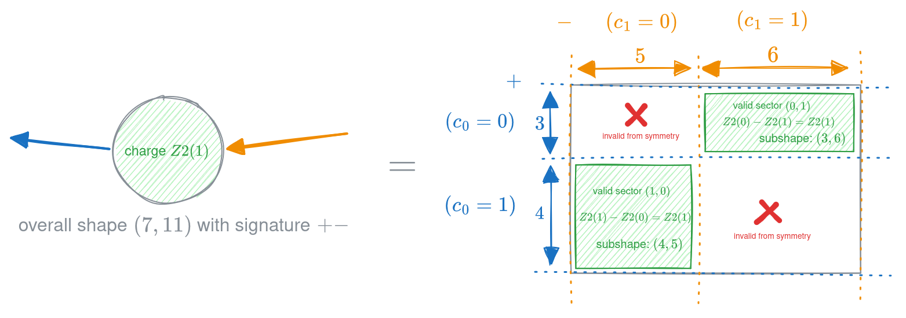

# Abelian arrays

An abelian `symmray` array has four main parts:

1. [`indices`](#symmray.array_common.ArrayCommon.indices) describe the charge
   sectors and orientation of each axis.
2. [`charge`](#symmray.sparse.sparse_array_common.SparseArrayCommon.charge) is
   the total charge of the array.
3. [`blocks`](#symmray.sparse.sparse_data_common.BlockCommon.blocks) contain
   the nonzero sectors allowed by charge conservation.
4. [`symmetry`](#symmray.array_common.ArrayCommon.symmetry) defines how charges
   combine and invert.

The default sparse layout stores
[`blocks`](#symmray.sparse.sparse_data_common.BlockCommon.blocks) as a
dictionary from a sector tuple to an array.

## Indices and charge

A [`BlockIndex`](#BlockIndex) maps each charge to its size. Its
[`dual`](#symmray.index_common.Index.dual) flag sets the orientation:

- `dual=False` is outward, positive, or ket-like
- `dual=True` is inward, negative, or bra-like

[`BlockIndex.conj`](#symmray.sparse.sparse_index.BlockIndex.conj) returns a
copy with `dual` flipped.

For example:

```python
import numpy as np
import symmray as sr

indices = (
    sr.BlockIndex({0: 3, 1: 4}, dual=False),
    sr.BlockIndex({0: 5, 1: 6}, dual=True),
)

x = sr.Z2Array.from_fill_fn(
    fill_fn=np.ones,
    indices=indices,
    charge=1,
)
```

The valid sectors are `(0, 1)` and `(1, 0)`. Their block shapes are `(3, 6)`
and `(4, 5)`.



## Construction

Common constructors are:

- the array class itself, with explicit indices, charge, and blocks
- [`SparseArrayCommon.from_blocks`](#SparseArrayCommon.from_blocks), which
  infers index charge maps from explicit blocks
- [`SparseArrayCommon.from_fill_fn`](#SparseArrayCommon.from_fill_fn), which
  fills every allowed sector
- [`SparseArrayCommon.random`](#SparseArrayCommon.random)
- [`SparseArrayCommon.from_dense`](#SparseArrayCommon.from_dense), which needs
  a charge assignment for each dense axis

The concrete classes [`Z2Array`](#symmray.sparse.sparse_abelian_array.Z2Array),
[`U1Array`](#symmray.sparse.sparse_abelian_array.U1Array),
[`Z2Z2Array`](#symmray.sparse.sparse_abelian_array.Z2Z2Array), and
[`U1U1Array`](#symmray.sparse.sparse_abelian_array.U1U1Array) fix the symmetry.
Use [`AbelianArray`](#AbelianArray) with an explicit symmetry for a dynamic
symmetry such as [`ZN`](#ZN).

## Dense conversion

[`from_dense`](#SparseArrayCommon.from_dense) uses `index_maps` to assign each
dense axis position to a charge sector, then packs those sectors contiguously 
internally. Passing the same maps to `to_dense` restores the original basis 
positions, so the dense array roundtrips without storing its ordering as tensor 
metadata.

For example, consider a merged spinful-fermion basis ordered as `(empty, down,
up, double)`, with Z2 charges `(0, 1, 1, 0)`:

```python
array = np.diag([1.0, 2.0, 3.0, 4.0])
index_maps = ((0, 1, 1, 0),) * array.ndim

x = sr.utils.from_dense(
    array,
    symmetry="Z2",
    index_maps=index_maps,
    duals=(False, True),
)

np.testing.assert_allclose(x.to_dense(index_maps=index_maps), array)
```

Repeated charges select degeneracy offsets in occurrence order. Calling
`to_dense()` without `index_maps` instead returns the canonical representation
with charge sectors packed in sorted contiguous order.

## Operations

The main NumPy-like operations are
[`conj`](#symmray.interface.conj),
[`einsum`](#symmray.interface.einsum),
[`reshape`](#symmray.interface.reshape),
[`tensordot`](#symmray.interface.tensordot),
[`trace`](#symmray.interface.trace), and
[`transpose`](#symmray.interface.transpose). `symmray` also provides explicit
[`fuse`](#symmray.interface.fuse),
[`unfuse`](#symmray.bosonic_common.BosonicCommon.unfuse), and
[`multiply_diagonal`](#symmray.interface.multiply_diagonal) operations.

Indexing follows the internal packed axis order. Integer indexing removes an
axis, while slices retain it. Related operations include
[`take`](#symmray.interface.take), [`squeeze`](#symmray.interface.squeeze),
[`expand_dims`](#symmray.interface.expand_dims), and
[`align_axes`](#symmray.interface.align_axes).

Fusion groups sectors by their combined charge. This turns tensor contractions
and decompositions into blockwise matrix operations.

Sparse [`tensordot`](#symmray.interface.tensordot) supports two main modes:

- `mode="fused"` fuses each operand into block-diagonal matrices, contracts
  them, then unfuses the result
- `mode="blockwise"` finds and contracts compatible pairs of blocks directly

`mode="auto"` selects a mode from the array structure and configured default.

:::{tip}
Use [`default_tensordot_mode`](#symmray.sparse.sparse_array_common.default_tensordot_mode)
to change the default temporarily. The corresponding
[`set_default_tensordot_mode`](#symmray.sparse.sparse_array_common.set_default_tensordot_mode)
and
[`get_default_tensordot_mode`](#symmray.sparse.sparse_array_common.get_default_tensordot_mode)
functions change or inspect it directly.
:::

## Symmetries

`symmray` includes [`Z2`](#symmray.symmetries.Z2),
[`U1`](#symmray.symmetries.U1), [`Z2Z2`](#symmray.symmetries.Z2Z2),
[`U1U1`](#symmray.symmetries.U1U1), and general finite cyclic
[`ZN`](#symmray.symmetries.ZN) symmetries. A
[`Symmetry`](#symmray.symmetries.Symmetry) defines the zero charge, valid
charges, charge combination, charge inversion, and fermionic parity.

Finite cyclic symmetries are selected by name:

```python
z3 = sr.utils.get_rand(
    "Z3",
    shape=(6, 6),
    duals=(False, True),
    seed=1,
)
```

[`get_symmetry`](#symmray.symmetries.get_symmetry) resolves names such as `Z3`.
[`get_zn_symmetry_cls`](#symmray.symmetries.get_zn_symmetry_cls) returns the
corresponding symmetry class.

See [`symmray.symmetries`](symmray.symmetries) for the base interface and built-in
implementations.
