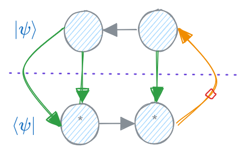

# Fermionic arrays

Fermionic `symmray` arrays use a graded algebra. Each charge has a fermionic
parity, and each index has an orientation. Together these determine the sign
produced when indices or operators exchange order.

[`FermionicArray`](#FermionicArray) extends the abelian array model with phase
bookkeeping:

```python
import symmray as sr

indices = (
    sr.BlockIndex({-1: 2, 0: 2, 1: 3}, dual=False),
    sr.BlockIndex({0: 2, 2: 3, 3: 4}, dual=True),
)

x = sr.U1FermionicArray.random(indices=indices, charge=-2, seed=1)
```

The flat equivalent is [`FermionicArrayFlat`](#FermionicArrayFlat). Both
layouts expose the same high-level phase rules.

## Phase handling

`symmray` records sector phases lazily during
[`transpose`](#symmray.interface.transpose),
[`fusion`](#symmray.interface.fuse),
[`conjugation`](#symmray.interface.conj),
[`contraction`](#symmray.interface.tensordot),
[`tracing`](#symmray.interface.trace), and linear algebra. Three methods expose
the core model:

- [`phase_flip`](#symmray.sparse.sparse_fermionic_array.FermionicArray.phase_flip)
  inserts a virtual parity operator on selected axes
- [`phase_transpose`](#symmray.sparse.sparse_fermionic_array.FermionicArray.phase_transpose)
  records the sign of a virtual permutation
- [`phase_sync`](#symmray.sparse.sparse_fermionic_array.FermionicArray.phase_sync)
  multiplies pending phases into the stored blocks

Most code should use normal array operations and let these methods be called
internally.

## Conjugation

[`x.conj()`](#symmray.sparse.sparse_fermionic_array.FermionicArray.conj)
conjugates the numerical data and accounts for reversing the order of
fermionic operators. Its two main phase options are:

- `phase_permutation=True` applies the sign from reversing the axis order
- `phase_dual=False` leaves dual-axis parity operators unapplied

The defaults are suitable for a tensor-network wavefunction whose open physical
indices are all ket-like. If a network has both ket-like and bra-like open
indices, the dual open indices of the conjugated network may need explicit
phase flips.

Use
[`x.conj_project(axes=...)`](#symmray.fermionic_common.FermionicCommon.conj_project)
when inserting an array together with its conjugate as a projector. `axes`
accepts either one integer or an ordered sequence selecting the uncontracted
bonds. The first selected axis sets the reference duality inherited when the
open axes are fused. The method handles the dualities of every contracted axis
and the global sign of odd-parity arrays for both sparse and flat storage.



## Odd-parity arrays

An odd-parity array needs a stable position in the global fermionic ordering.
Set its [`label`](#SparseArrayCommon.label) so `symmray` can create and order a
[`dummy mode`](#FermionicCommon.dummy_modes):

```python
x = sr.utils.get_rand(
    "Z2",
    shape=(4, 6),
    charge=1,
    fermionic=True,
    label="x",
    seed=1,
)
```

See [Dummy fermionic modes](dummy_modes.md) for contraction, conjugation, and
slicing rules. See [Local operators](fermionic_operators.md) for built-in
local operators and custom construction.
